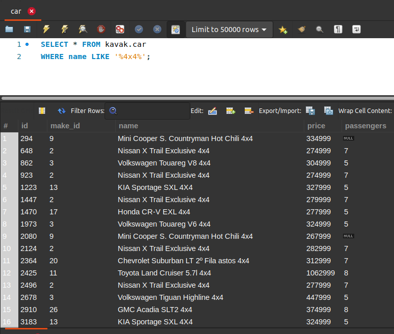
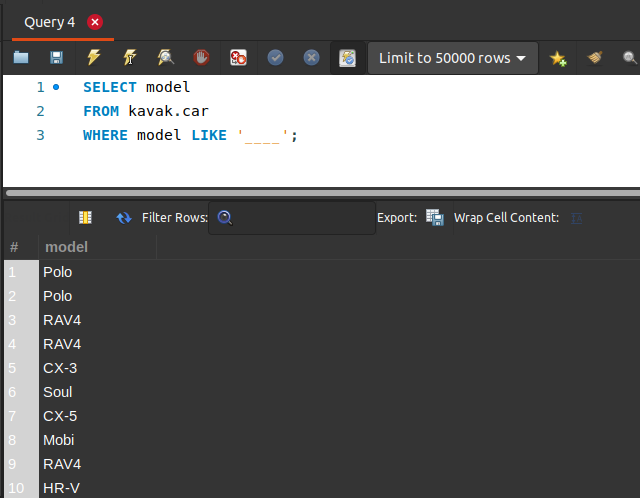

[`Introducción a Bases de Datos`](../../Readme.md) > [`Sesión 02`](../Readme.md) > `Reto 1`
	
## Reto 1: Agrupamientos y subconsultas

<div style="text-align: justify;">

### 1. Objetivos :dart:

- Escribir consultas que permitan responder a algunas preguntas.

### 2. Requisitos :clipboard:

1. MySQL Workbench instalado.

### 3. Desarrollo :rocket:

Usando la base de datos `kavak`, escribe consultas que permitan responder las siguientes preguntas.

- ¿Qué autos según su nombre son `4x4`?
- ¿Cuáles son las marcas cuyo nombre inicia con la letra `A`?
- ¿Qué modelos de auto tienen sólo 4 caracteres?

<details><summary>Solución</summary>
<p>

- ¿Qué autos según su nombre son `4x4`?

   ```sql
   SELECT *
   FROM kavak.car
   WHERE name LIKE '%4x4%';
   ```
   

- ¿Cuáles son las marcas cuyo nombre inicia con la letra `A`?

   ```sql
   SELECT *
   FROM kavak.make
   WHERE name LIKE 'A%';
   ```
   
   
- ¿Qué modelos de auto tienen sólo 4 caracteres?

   ```sql
   SELECT model
   FROM kavak.car
   WHERE model LIKE '____';
   ```
    

</p>
</details>

<br/>

[`Anterior`](../Ejemplo-01/Readme.md) | [`Siguiente`](../Readme.md#funciones-de-agrupamiento)   


</div>
