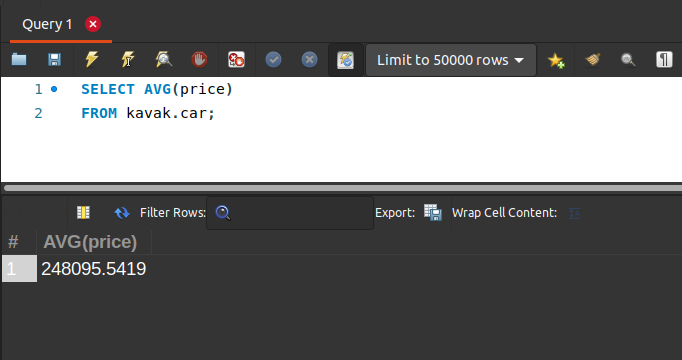
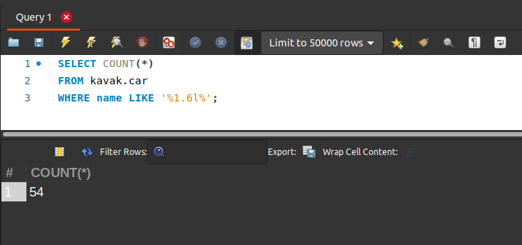
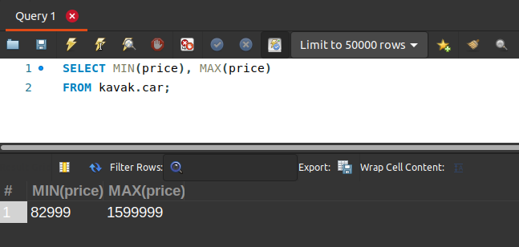
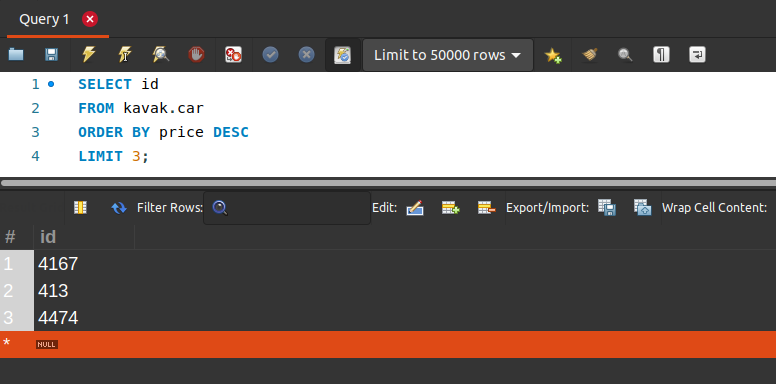
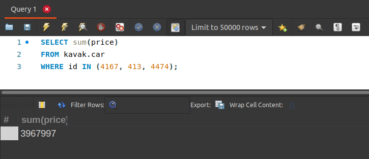

[`Introducción a Bases de Datos`](../../Readme.md) > [`Sesión 02`](../Readme.md) > `Reto 2`
	
## Reto 2: Funciones de agrupamiento

<div style="text-align: justify;">

### 1. Objetivos :dart:

- Escribir consultas que permitan responder a algunas preguntas.

### 2. Requisitos :clipboard:

1. MySQL Workbench instalado.

### 3. Desarrollo :rocket:

Usando la base de datos `kavak`, escribe consultas que permitan responder las siguientes preguntas.

- ¿Cuál es el precio promedio un auto en Kavak?
- ¿Cuántos autos según su nombre son de `1.6l`?
- ¿Cuál es el precio mínimo y máximo de todos los autos?
- ¿Cuál es la suma del precio de los tres autos más caros?

<details><summary>Solución</summary>
<p>

- ¿Cuál es el precio promedio un auto en Kavak?

   ```sql
   SELECT AVG(price)
   FROM kavak.car;
   ```
   

- ¿Cuántos autos según su nombre son de `1.6l`?

   ```sql
   SELECT COUNT(*)
   FROM kavak.car
   WHERE name LIKE '%1.6l%';
   ```
   
   
- ¿Cuál es el precio mínimo y máximo de todos los autos?

   ```sql
   SELECT MIN(price), MAX(price)
   FROM kavak.car;
   ```
   
   
- ¿Cuál es la suma del precio de los tres autos más caros?

   Primero obtenemos los ids de los autos
   
   ```sql
   SELECT id
   FROM kavak.car
   ORDER BY price DESC
   LIMIT 3;
   ```
   
   
   
   Usamos esos ids y los sumamos.

   ```sql
   SELECT sum(price)
   FROM kavak.car
   WHERE id IN (4167, 413, 4474);
   ```
   

</p>
</details>

<br/>

[`Anterior`](../Ejemplo-02/Readme.md) | [`Siguiente`](../Readme.md#agrupamientos)      

</div> 
