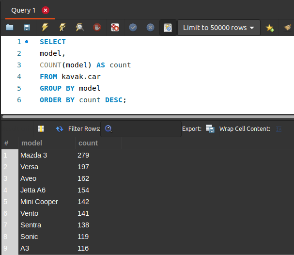
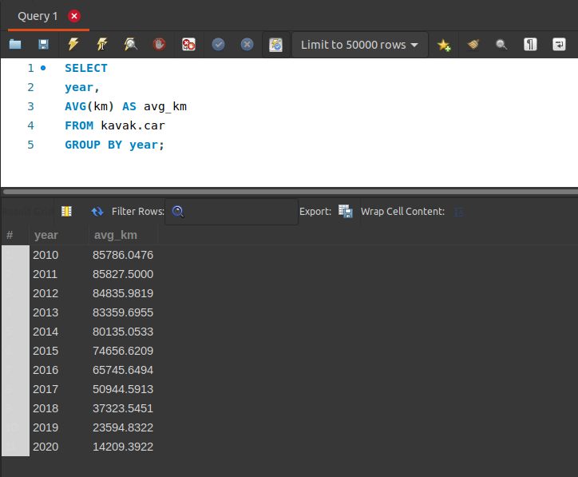
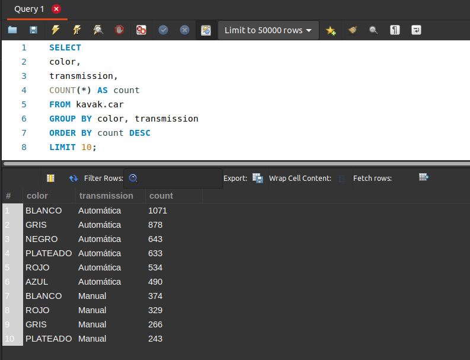

[`Introducción a Bases de Datos`](../../Readme.md) > [`Sesión 02`](../Readme.md) > `Reto 3`
	
## Reto 3: Agrupamientos

<div style="text-align: justify;">

### 1. Objetivos :dart:

- Escribir consultas que permitan responder a algunas preguntas.

### 2. Requisitos :clipboard:

1. MySQL Workbench instalado.

### 3. Desarrollo :rocket:

Usando la base de datos `kavak`, escribe consultas que permitan responder las siguientes preguntas.

1. ¿Cuántos registros hay por cada uno de los modelos?
1. ¿Cuál es el promedio de kilometraje de los autos dependiendo de su año?
1. ¿Cuál son las 10 combinaciones de color - transmisión más comunes? (P.E. BLANCO - Automático)

<details><summary>Solución</summary>
<p>

- ¿Cuántos registros hay por cada uno de los modelos?

   ```sql
   SELECT 
   model,
   COUNT(model) AS count
   FROM kavak.car
   GROUP BY model
   ORDER BY count DESC;
   ```
   

- ¿Cuál es el promedio de kilometraje de los autos dependiendo de su año?

   ```sql
   SELECT
   year,
   AVG(km) AS avg_km
   FROM kavak.car
   GROUP BY year;
   ```
   
   
- ¿Cuál son las 10 combinaciones de color - transmisión más comunes? (P.E. BLANCO - Automático)
   
   ```sql
   SELECT
   color,
   transmission,
   COUNT(*) AS count
   FROM kavak.car
   GROUP BY color, transmission
   ORDER BY count DESC
   LIMIT 10;
   ```
   
   

</p>
</details> 

<br/>

[`Anterior`](../Ejemplo-03/Readme.md) | [`Siguiente`](../Readme.md#subconsultas)         

</div>
