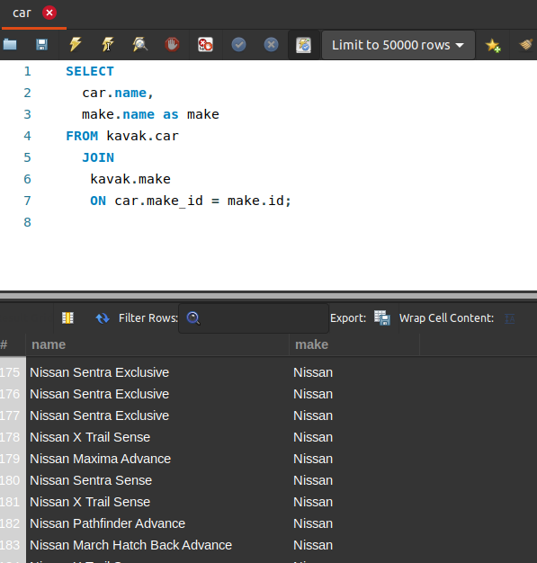
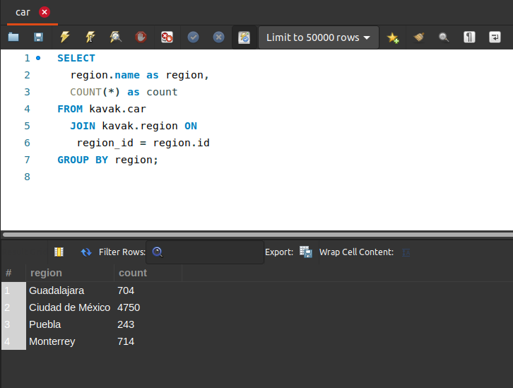
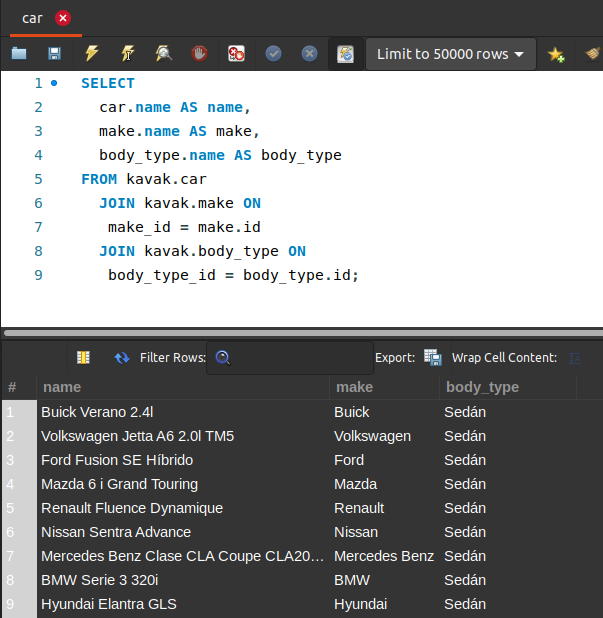

[`Introducción a Bases de Datos`](../../Readme.md) > [`Sesión 03`](../Readme.md) > `Reto 1`
	
## Reto 1: Agrupamientos y subconsultas

<div style="text-align: justify;">

### 1. Objetivos :dart:

- Escribir consultas que permitan responder a algunas preguntas.

### 2. Requisitos :clipboard:

1. MySQL Workbench instalado.

### 3. Desarrollo :rocket:

Usando la base de datos `kavak`, escribe consultas que permitan responder las siguientes preguntas.

- Muestra una tabla con el nombre y marca de cada auto
- ¿Cuántos autos hay por cada una de las ciudades?
- Muestra una tabla con el nombre, marca y tipo de carrocería (body_type) de cada auto

<details><summary>Solución</summary>
<p>

- Muestra una tabla con el nombre y marca de cada auto

   ```sql
   SELECT 
   car.name, 
   make.name as make
   FROM kavak.car 
     JOIN
       kavak.make 
       ON car.make_id = make.id;
   ```
   
   

- ¿Cuántos autos hay por cada una de las ciudades?

   ```sql
   SELECT 
     region.name as region,
     COUNT(*) as count
   FROM kavak.car
     JOIN kavak.region ON
     region_id = region.id
   GROUP BY region;
   ```
   
   
   
- Muestra una tabla con el nombre, marca y tipo de carrocería (body_type) de cada auto

   ```sql
   SELECT 
     region.name as region,
     COUNT(*) as count
   FROM kavak.car
     JOIN kavak.region ON
     region_id = region.id
   GROUP BY region;
   ```
    

</p>
</details> 

<br/>

[`Anterior`](../Ejemplo-01/Readme.md) | [`Siguiente`](../Readme.md#definición-de-vistas)

</div>
