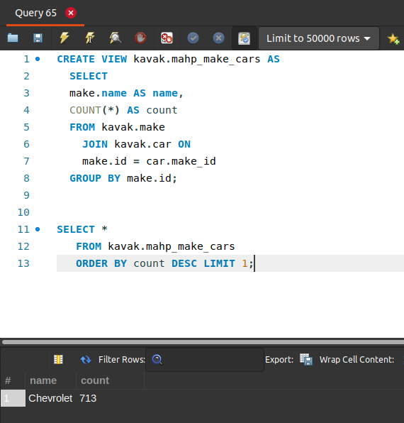

[`Introducción a Bases de Datos`](../../Readme.md) > [`Sesión 03`](../Readme.md) > `Reto 2`
	
## Reto 2: Definición de vistas

<div style="text-align: justify;">

### 1. Objetivos :dart:

- Crear una vista a partir de una consulta.

### 2. Requisitos :clipboard:

1. MySQL Workbench instalado.

### 3. Desarrollo :rocket:

Usando la base de datos `kavak`, crea una vista que muestre las marcas y el número de autos que hay por cada una de ellas.
Nómbrala como `<tus iniciales>_make_cars`.
Haz una consulta sobre tu vista y obten la marca con mayor número de autos.

<details><summary>Solución</summary>
<p>

- Obtener el puesto de un empleado.

   ```sql
  CREATE VIEW kavak.mahp_make_cars AS
     SELECT
     make.name AS name,
     COUNT(*) AS count
     FROM kavak.make
       JOIN kavak.car ON
       make.id = car.make_id
     GROUP BY make.id;
   ```
   
   ```sql
   SELECT *
   FROM kavak.mahp_make_cars
   ORDER BY count DESC LIMIT 1;
   ```
   
   

</p>
</details> 

<br/>

[`Anterior`](../Ejemplo-02/Readme.md) | [`Siguiente`](../Readme.md#3-proyecto-hammer)

</div>
